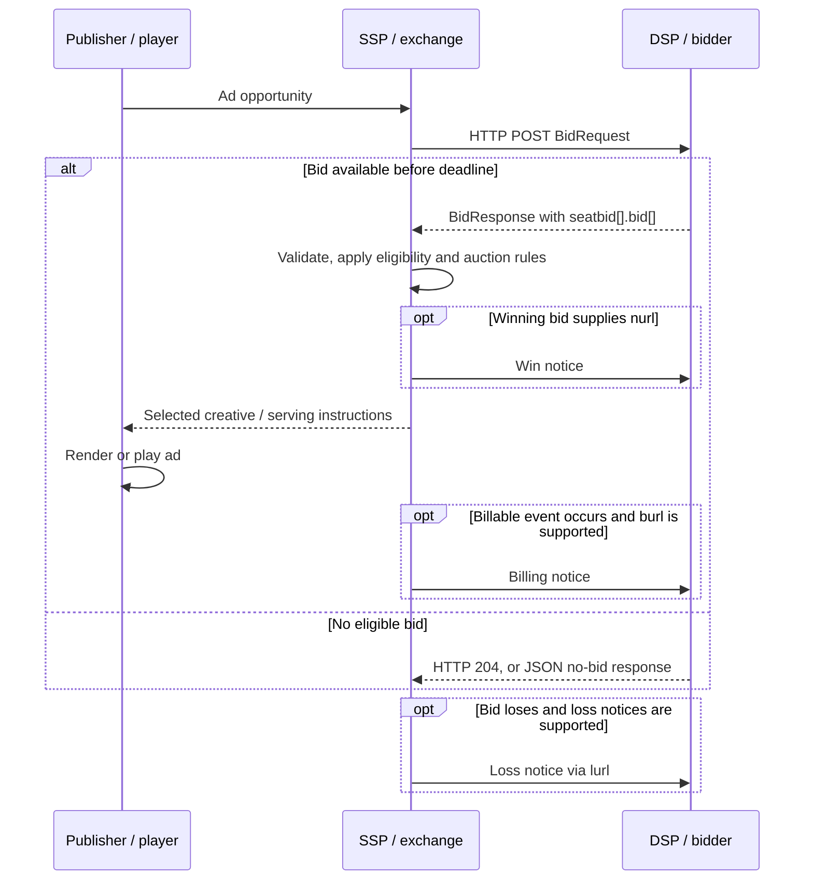

# OpenRTB reference for Real Open Bidding

Status: research baseline, not the Real Open Bidding specification. Reviewed on 2026-09-08.

This document maps the existing real-time advertising bidding ecosystem so we can decide what Real Open Bidding should retain, change, or leave out. The established protocol is **OpenRTB** (Open Real-Time Bidding); “OpenRTV” in the initial request is interpreted as OpenRTB.

The field reference covers every request and response object in **OpenRTB 2.6-202606**, including deprecated fields and the explicitly provisional field. Native's embedded payload and companion specifications are described separately. Exchange-specific extensions are open-ended and cannot be exhaustively catalogued. This is a readable reference, not a replacement for the normative specification or a claim of interoperability.

Primary baseline: [IAB Tech Lab OpenRTB 2.6-202606][ortb], [implementation guidance][impl], and [release history][releases]. This dated release was published on 2026-06-11. The HTTP version remains `2.6`; the release suffix identifies the document baseline, not an HTTP header value. Enum lists evolve separately in [AdCOM][adcom].

## Contents

- [1. Participants and boundaries](#1-participants-and-boundaries)
- [2. Specifications around the auction](#2-specifications-around-the-auction)
- [3. Transaction flows](#3-transaction-flows)
- [4. Wire contract and common semantics](#4-wire-contract-and-common-semantics)
- [5. Request field reference](#5-request-field-reference)
- [6. Response field reference](#6-response-field-reference)
- [7. Native payloads](#7-native-payloads)
- [8. Notifications and macros](#8-notifications-and-macros)
- [9. Worked examples](#9-worked-examples)
- [10. Compatibility and validation](#10-compatibility-and-validation)
- [11. Decisions for Real Open Bidding](#11-decisions-for-real-open-bidding)
- [12. Sources and attribution](#12-sources-and-attribution)

## 1. Participants and boundaries

| Participant or concept | Responsibility |
| --- | --- |
| Publisher / inventory owner | Makes ad placements available on a website, app, stream, or physical screen. |
| Browser, app SDK, player, or screen | Requests and displays the ad; may emit delivery and interaction events. |
| Ad server / mediation layer / header-bidding wrapper | Coordinates demand sources and may make the final allocation decision. |
| Supply-side platform (SSP) / exchange | Describes inventory, solicits bids, validates responses, and runs an auction. An SSP can also pass bids to an upstream auction. |
| Demand-side platform (DSP) / bidder | Evaluates opportunities for buyers and returns bids and creative information. |
| Buyer seat | Buyer account represented by a bidder; seat identifiers are agreed with the exchange. |
| Advertiser / campaign / creative | The business buying exposure, its buying initiative, and the actual ad. These have different identifiers. |
| Impression opportunity | Inventory being offered. An auction win is not evidence that an ad was displayed. |
| Deal | Previously negotiated commercial terms referenced during bidding. |
| Verification / measurement provider | Supplies quality, delivery, viewability, or other measurement signals. |

OpenRTB standardizes the exchange–bidder messages and associated notices. Publisher SDK APIs, campaign setup, budget management, auction implementation, contracts, invoicing, payment settlement, and delivery guarantees are not fully specified by that interface. See [OpenRTB's reference model and scope][ortb].

## 2. Specifications around the auction

| Specification | What it covers | Relationship to this reference |
| --- | --- | --- |
| [OpenRTB 2.6][ortb] | Bid requests, responses, and win/billing/loss notices. | Main JSON field model below. Dated releases add compatible changes. |
| [OpenRTB 3.0][ortb3] | A distinct transaction model with an `openrtb` envelope and request items / response bids. | Uses AdCOM for domain objects; not a drop-in renaming of 2.6. Its existence does not make the 2.6 line obsolete. |
| [AdCOM 1.0][adcom] | Shared advertising objects and enumerations. | Supplies 2.6's shared enum vocabulary; supplies the domain model used with 3.0. |
| [Dynamic Native Ads API][native] | Structured native asset requests, responses, links, and event trackers. | Embedded as serialized JSON in 2.6's `native.request` and native `bid.adm`. |
| [VAST][vast] | XML describing video/audio ads, assets, wrappers, and tracking. | Common creative payload for `Video` and `Audio`; separate versioning from OpenRTB. |
| [VMAP][vmap] | Video ad-break scheduling. | Describes where breaks occur; does not replace the bid auction. |
| [MRAID][mraid] | Rich-media ad interaction with mobile app containers. | Capabilities are signaled through API-framework fields. |
| [SIMID][simid] | Interactive video creative–player communication. | A creative capability used alongside VAST. |
| [Open Measurement][omid] | Standardized measurement integration. | Complements serving and billing events; a measurement event is not automatically billable. |
| [ads.txt / app-ads.txt][adstxt] | Publisher declarations of authorized advertising systems and seller accounts. | Out-of-band inventory authorization. |
| [sellers.json][sellers] | Advertising systems' seller-account disclosures. | Resolves seller identities used in a supply chain. |
| [SupplyChain object][schain] | Ordered seller/payment-path information attached to a request. | `source.schain` in modern 2.6. It is a declaration, not a cryptographic proof. |
| [ads.cert][adscert] | Authentication standards for advertising communications. | Separate from ordinary 2.6 JSON and supply-chain declarations. |
| [Global Privacy Platform][gpp] and [TCF technical specifications][tcf] | Encoded privacy/consent signals. | Transported in `regs` and `user`; the strings need their own parsers and policy handling. |
| [Content, ad-product, and audience taxonomies][taxonomies] | Classification vocabularies. | Interpret category values together with their taxonomy selectors. |
| [Ad Management API][admanagement] | Creative registration/review between bidders and exchanges. | An optional workflow outside the per-impression auction. |
| [OpenDirect][opendirect] | Automated direct buying workflows. | Related commercial automation, distinct from a real-time bid request. |

These are different layers. Supporting OpenRTB alone does not imply support for every creative API, privacy framework, or inventory-verification mechanism in this table.

## 3. Transaction flows

### 3.1 Open auction



The exchange commonly solicits multiple bidders in parallel. Each bid references an offered impression. It evaluates price together with restrictions, format compatibility, deal eligibility, and other auction rules. A valid response need not contain a bid for every impression. The diagram illustrates one bidder and the inline-markup serving path; notice timing and the final decision-maker can differ. [Source: auction model and serving options][ortb].

### 3.2 No bid, invalid traffic, and timeout

1. A bidder deliberately declining a valid request can return an empty HTTP `204`, or HTTP `200` with a response ID and no bids; `nbr` can explain the no-bid reason.
2. A malformed request is a different condition: the transport guidance uses HTTP `400` without a body.
3. A response arriving outside `tmax` misses the exchange's deadline. A transport failure or silence is not an explicit no-bid response.
4. A response can contain bids that fail validation or lose. `lurl` can carry loss information where supported; no-bid reasons and loss reasons are different code lists.
5. Retry policy, timeout accounting, and duplicate suppression require an integration agreement; the baseline does not create an exactly-once auction service.

Sources: [transport][ortb], [no-bid guidance][impl].

### 3.3 Header bidding and other upstream auctions

A publisher-side wrapper or server can ask several SSPs for bids and then let an ad server select the final winner. Each SSP may conduct its own auction first. `source.fd=1` identifies upstream final decisioning, while `source.tid` correlates the shared transaction. `source.schain` describes the supply path. A local auction outcome and the final impression sale must be distinguished in notice and reporting contracts. `AUCTION_MIN_TO_WIN` describes the reporting exchange's auction, not a promise of winning every upstream decision. [Sources: Source and macros][ortb].

### 3.4 Private marketplaces and direct deals

1. Buyer and seller negotiate terms and establish a deal ID outside the auction.
2. The seller includes applicable `imp.pmp.deals[]` entries with price, seats, advertisers, and other constraints.
3. `pmp.private_auction=1` restricts bidding to the listed deals and their terms; `0` also permits non-deal bids.
4. A participating bidder returns `bid.dealid` matching the selected deal's `id`.
5. `Deal.at` can override the request's auction type. Value `3` means the deal's `bidfloor` is its agreed price. `Deal.guar=1` signals a guaranteed deal and an obligation for the bidder to bid.

Deal priority, reservation, pacing, make-goods, and settlement still need commercial and technical agreements. `Deal.bidfloorcur` independently defaults to USD; it does not inherit `Imp.bidfloorcur`. [Sources: Pmp/Deal][ortb] and [deal guidance][impl].

### 3.5 Banner, multi-format, mobile, and rewarded ads

- **Banner:** the seller describes accepted dimensions or flexible ratios, MIME types, position, and APIs. The buyer supplies compatible markup, often through `adm`.
- **Multi-format:** one `Imp` can offer several of `banner`, `video`, `audio`, and `native`; a particular bid selects one offered type. `Bid.mtype` identifies that type. Offering multiple types does not create multiple independent impressions.
- **Mobile:** `app`, `device`, SDK/renderer fields, API support, and interstitial information describe the environment. Identifier availability must not be assumed.
- **Rewarded:** `imp.rwdd=1` describes an opportunity where the viewer receives a reward. This flag does not implement reward delivery or verification.
- **Refresh:** `imp.refresh` describes automatic refresh behavior and count. Refresh intervals describe exposure opportunities, not guaranteed viewability.

Sources: [Imp, Banner, Format, Refresh][ortb].

### 3.6 Video, audio, CTV, and ad pods

The seller specifies acceptable MIME types, VAST protocols, durations, player/API capabilities, placement, and delivery requirements. The buyer responds with matching creative metadata and markup. For video, `plcmt` identifies the placement type; `linearity` describes the expected creative behavior and is a separate concept. Connected TV (CTV) is an environment, typically represented through `app`, device type, and content metadata, rather than a fifth media object. [Source: request media objects][ortb].

| Pod model | Representation and selection |
| --- | --- |
| Structured | Multiple impression opportunities describe predetermined slots, linked by `podid`. Slot constraints describe each opportunity. |
| Dynamic | An opportunity describes a fillable duration using `poddur` and potentially `maxseq`; multiple bids can fill that duration. |
| Hybrid | Predetermined slots and dynamic portions coexist within a pod. |

`rqddurs` lists exact allowed creative durations and is mutually exclusive with `minduration`/`maxduration`. `poddur` is required for dynamic portions, despite being marked recommended in the general field table. `podseq` positions the break within the stream; `slotinpod` describes a slot within a break. `Bid.dur` enables duration-aware selection. Floors can use CPM, CPM per second, or duration ranges. For example, a floor of `0.10` CPM per second implies `3.00` CPM for a 30-second ad before applying other applicable floor rules. [Source: pod and floor guidance][impl].

For server-side ad insertion, `imp.ssai` distinguishes unknown, client-side, server-stitched/client-tracked, and fully server-side delivery. Asset retrieval, tracking, and billing must reflect the actual arrangement. `Content.livestream` now means scheduled/linear broadcast; `realtime` and `firstbroadcast` separately indicate an event happening now and a first broadcast. A scheduled replay can therefore be linear without being real-time. [Source: Imp/Content and June 2026 release][ortb].

### 3.7 Native ads

The seller requests named assets such as a title, image, or sponsor label in a serialized Native request. The buyer returns structured assets whose IDs match the request, plus destination links and trackers. The publisher renders those assets in its own layout. Required assets must be satisfied. Native has its own version and schema, and a native response is not ordinary banner HTML. See [Native payloads](#7-native-payloads) and the [Native specification][native].

### 3.8 Digital out-of-home

DOOH uses the top-level `dooh` context together with an impression's supported media. `imp.qty.multiplier` communicates estimated audience-impression quantity for a display, and `imp.dt` can communicate its expected display timestamp. Notice macros can confirm the actual quantity and display time. Winning quantity can be fractional and cannot exceed the offered multiplier. One screen play need not equal one audience impression. [Sources: DOOH and Qty][ortb], [DOOH guidance][impl].

### 3.9 Privacy signals and identifier matching

Before sending a request, the supply side determines which signals and identifiers it can send under its applicable policies. The wire model includes `regs.gdpr`, `regs.coppa`, `regs.gpp`, `regs.gpp_sid`, `user.consent`, `device.dnt`, and `device.lmt`. Bidders interpret encoded strings using the relevant framework; a present identifier or a missing flag is not itself permission for a use. This section describes protocol signals, not a legal compliance determination. [Sources: OpenRTB privacy objects][ortb], [GPP][gpp], [TCF][tcf].

Traditional cookie syncing maps exchange and bidder identifiers before bidding; `user.buyeruid` can carry the buyer's mapped identifier. Extended identity uses `user.eids[]` to carry namespaced IDs and provenance/match information. These are optional inputs: contextual bidding can operate without a persistent person identifier. Sync endpoints, redirects, retention, and partner policies need separate agreements. [Source: User/EID and cookie-sync appendix][ortb].

### 3.10 Supply authorization and creative review

Supply authorization combines publisher-side ads.txt/app-ads.txt declarations, the advertising system's sellers.json, and the request's SupplyChain nodes. Cross-check advertising-system domains and seller IDs; these documents answer related but different questions. Creative review can happen before bidding through an agreed workflow or the Ad Management API, with `adid`, `crid`, `cid`, domains, categories, and attributes used during serving and validation. Neither process is replaced by selecting the highest price. [Sources: ads.txt][adstxt], [sellers.json][sellers], [SupplyChain][schain], [Ad Management API][admanagement].

### 3.11 Serving, tracking, billing, and reconciliation

A bidder can send markup in `bid.adm`, return it from a win-notice response, or refer to a preloaded ad by agreement. If markup is present in both `adm` and the win-notice response, `adm` takes precedence. `nurl` signals a win, `burl` signals the exchange-defined billable event, and `lurl` signals a loss. Rendering, impression tracking, viewability, clicks, completion, and financial settlement are separate events. Partners must agree which event creates a charge, how duplicate notices are handled, and how reporting reconciles with invoicing. [Source: serving and notice semantics][ortb].

## 4. Wire contract and common semantics

| Topic | OpenRTB baseline |
| --- | --- |
| Transport | HTTP POST for bid requests; HTTPS strongly recommended. Win notices may use GET or POST at the exchange's discretion. Endpoint paths and authentication are integration-specific. |
| Representation | JSON is suggested. `Content-Type: application/json`; the response uses the same representation as the request. Alternative encodings need compatible implementations. |
| Version | Request header `x-openrtb-version: 2.6`; a response version header is recommended but optional. |
| Compression | Use HTTP encoding headers. Request gzip support must be agreed; response support can be advertised by `Accept-Encoding: gzip`. |
| Responses | `200` with content; `204` for a successful no-content response; `400` without content for malformed requests. |
| Deadline | `tmax` is milliseconds including network latency. It is not just the bidder's computation budget. |
| Identifiers | Strings, even when they look numeric. Scope matters: request, impression, transaction, seller, seat, campaign, and creative IDs are different. |
| Presence | Missing usually means unknown unless a default or a specific absence rule is defined. Do not replace missing with `0`, `false`, `null`, or an empty array indiscriminately. |
| Flags | Many booleans are JSON integers `0` or `1`, not JSON booleans. Follow each field's declared type. |
| Money | Bid prices and ordinary floors are CPM (cost per thousand impressions), in the applicable ISO-4217 currency. Use precise decimal or fixed-point arithmetic internally. |
| Time and dimensions | Duration/expiry fields usually use seconds; `tmax` uses milliseconds; `imp.dt` and `AUCTION_IMP_TS` use epoch milliseconds; ad dimensions generally use device-independent pixels. |
| Compatibility | Tolerate unknown fields and enum values gracefully. Keep extensions in `ext`; document their semantics with partners. |

Sources: [OpenRTB transport, versioning, and field definitions][ortb].

At `2.50` CPM, one ordinary impression represents `2.50 / 1000 = 0.0025` currency units before any independently agreed adjustments. With a confirmed audience quantity of `12.0`, the corresponding amount is `2.50 × 12 / 1000 = 0.03`. `price` is still CPM; it is not the total amount for the request, pod, or screen play. [Sources: Bid and multiplier semantics][ortb].

### Object relationships

```text
BidRequest
  source -> Source -> schain -> SupplyChain -> nodes[] -> SupplyChainNode
  regs -> Regs
  imp[] -> Imp
    banner -> Banner -> format[] -> Format
    video -> Video -> companionad[] -> Banner; durfloors[] -> DurFloors
    audio -> Audio -> companionad[] -> Banner; durfloors[] -> DurFloors
    native -> Native -> request (serialized Native JSON)
    pmp -> Pmp -> deals[] -> Deal -> durfloors[] -> DurFloors
    metric[] -> Metric; qty -> Qty; refresh -> Refresh -> refsettings[] -> RefSettings
  site OR app OR dooh -> Site / App / DOOH
    publisher -> Publisher
    content -> Content -> producer / network / channel / data[]
  device -> Device -> geo -> Geo; sua -> UserAgent -> BrandVersion
  user -> User -> geo -> Geo; data[] -> Data -> segment[] -> Segment
    eids[] -> EID -> uids[] -> UID

BidResponse -> seatbid[] -> SeatBid -> bid[] -> Bid
  Bid.impid references BidRequest.imp[].id
  Bid.dealid references the applicable Imp.pmp.deals[].id
```

## 5. Request field reference

The tables list wire keys, types, table-level requirements/defaults, and short meanings. **Required** applies when the enclosing object is present; it does not make an optional parent mandatory. “Recommended” remains optional at protocol level. Fields without a qualifier are optional. Conditional rules in the prose and validation section also apply. `ext` is an object for documented implementation extensions, not an unrestricted place to redefine standard keys. Each object heading links to the pinned authoritative definition.


### 5.1 BidRequest

Path: `root request`. [Authoritative definition][object-bidrequest].

| Key | Type; requirement / default | Meaning |
| --- | --- | --- |
| `id` | string; required | Exchange-assigned request ID; responses echo this value. |
| `imp` | object array; required | Nonempty array of offered `Imp` objects. |
| `site` | object; recommended | Website context; mutually exclusive with `app` and `dooh`. |
| `app` | object; recommended | Non-browser application context; mutually exclusive with `site` and `dooh`. |
| `dooh` | object | Physical-screen context; mutually exclusive with `site` and `app`. |
| `device` | object; recommended | Receiving device and execution environment. |
| `user` | object; recommended | Audience information, where available and permitted. |
| `test` | integer; default 0 | 0 for live traffic; 1 for non-billable test auctions. |
| `at` | integer; default 2 | Auction type: 1 first-price, 2 second-price-plus; 500+ exchange-specific. |
| `tmax` | integer | Response deadline in milliseconds, including network transit. |
| `wseat` | string array | Allowed buyer seats; use at most one of `wseat` and `bseat`. |
| `bseat` | string array | Blocked buyer seats; alternative to `wseat`. |
| `allimps` | integer; default 0 | 1 confirms all available impressions in this context are offered; 0 no/unknown. |
| `cur` | string array | Allowed ISO-4217 bid currencies; useful for multi-currency integrations. |
| `wlang` | string array | Allowed creative languages using ISO-639-1; alternative to `wlangb`. |
| `wlangb` | string array | Allowed creative languages using BCP 47; alternative to `wlang`. |
| `acat` | string array | Allowed advertiser categories; alternative to `bcat`. |
| `bcat` | string array | Blocked advertiser categories; alternative to `acat`. |
| `cattax` | integer; default 1 | Taxonomy selector for category codes; interpret codes using this vocabulary. |
| `badv` | string array | Blocked advertiser domains. |
| `bapp` | string array | Blocked advertised applications, identified by store IDs. |
| `source` | object | Upstream decisioning and supply-chain information. |
| `regs` | object | Regulatory applicability and privacy-framework signals. |
| `ext` | object | Documented implementation-specific extension object. |

### 5.2 Source

Path: `source`. [Authoritative definition][object-source].

| Key | Type; requirement / default | Meaning |
| --- | --- | --- |
| `fd` | integer, recommended | Final sale decision made by 0 exchange or 1 upstream source. |
| `tid` | string; recommended | Transaction ID shared across participants, potentially spanning exchanges. |
| `pchain` | string; recommended | Payment-ID chain using the separately defined TAG syntax. |
| `schain` | object; recommended | Ordered `SupplyChain` with completeness information. |
| `ext` | object | Documented implementation-specific extension object. |

### 5.3 Regs

Path: `regs`. [Authoritative definition][object-regs].

| Key | Type; requirement / default | Meaning |
| --- | --- | --- |
| `coppa` | integer | Sender's COPPA-applicability flag: 0 no, 1 yes. |
| `gdpr` | integer | Sender's GDPR-applicability flag: 0 no, 1 yes, absent unknown. |
| `us_privacy` | string | Legacy US Privacy string; not a substitute for all modern GPP sections. |
| `gpp` | string | Encoded Global Privacy Platform string. |
| `gpp_sid` | integer array | GPP section IDs applicable to this transaction. |
| `ext` | object | Documented implementation-specific extension object. |

### 5.4 Imp

Path: `imp[]`. [Authoritative definition][object-imp].

| Key | Type; requirement / default | Meaning |
| --- | --- | --- |
| `id` | string; required | Impression ID unique within the request; targeted by `Bid.impid`. |
| `metric` | object array | Array of historical or predicted `Metric` observations. |
| `banner` | object | Banner opportunity; one or more supported media objects must be present. |
| `video` | object | Video opportunity and player constraints. |
| `audio` | object | Audio opportunity and playback constraints. |
| `native` | object | Native opportunity with an embedded structured asset request. |
| `pmp` | object | Private-marketplace restrictions and applicable deals. |
| `displaymanager` | string | Renderer, SDK, or mediation technology name; recommended for video/apps. |
| `displaymanagerver` | string | Renderer, SDK, or mediation version; recommended for video/apps. |
| `instl` | integer; default 0 | Whether this is interstitial/full-screen inventory: 0 no, 1 yes. |
| `tagid` | string | Placement or ad-tag identifier. |
| `bidfloor` | float; default 0 | Minimum acceptable bid, in CPM. |
| `bidfloorcur` | string; default "USD" | Default currency for this impression's floors; deals have their own default. |
| `clickbrowser` | integer | App click destination browser: 0 embedded, 1 native. |
| `secure` | integer | 1 requires HTTPS creative assets/markup; absent means security state unknown. |
| `iframebuster` | string array | Supported exchange-specific iframe-buster names. |
| `rwdd` | integer; default 0 | Whether viewing gives a user reward: 0 no, 1 yes. |
| `ssai` | integer; default 0 | 0 unknown; 1 client-side; 2 server assets/client trackers; 3 all server-side. |
| `exp` | integer | Advisory auction-to-impression delay in seconds. |
| `qty` | object | Audience-impression quantity represented by a `Qty` multiplier. |
| `dt` | float | Estimated fulfillment time in milliseconds since Unix epoch. |
| `refresh` | object | Automatic-refresh settings and count. |
| `ext` | object | Documented implementation-specific extension object. |

### 5.5 Metric

Path: `imp[].metric[]`. [Authoritative definition][object-metric].

| Key | Type; requirement / default | Meaning |
| --- | --- | --- |
| `type` | string; required | Metric name from the exchange's documented vocabulary. |
| `value` | float; required | Metric measurement; probabilities use the range 0 to 1. |
| `vendor` | string; recommended | Measurement source; EXCHANGE is the suggested self-reported source name. |
| `ext` | object | Documented implementation-specific extension object. |

### 5.6 Banner

Path: `imp[].banner; video/audio.companionad[]`. [Authoritative definition][object-banner].

| Key | Type; requirement / default | Meaning |
| --- | --- | --- |
| `format` | object array; recommended | Allowed `Format` sizes or flexible shapes; preferred for size lists. |
| `w` | integer | Width in device-independent pixels. |
| `h` | integer | Height in device-independent pixels. |
| `btype` | integer array | Blocked banner types: 1 XHTML text, 2 XHTML banner, 3 JavaScript, 4 iframe. |
| `battr` | integer array | Disallowed creative-attribute codes. |
| `pos` | integer | On-screen placement position code. |
| `mimes` | string array | Accepted content MIME types. |
| `topframe` | integer | 0 iframe placement, 1 top-frame placement. |
| `expdir` | integer array | Allowed expansion directions. |
| `api` | integer array | Supported API-framework codes; unlisted frameworks are unsupported. |
| `id` | string | Banner identifier, especially useful for companions; unique within the impression. |
| `vcm` | integer | Companion mode: 0 alongside video, 1 end card. |
| `ext` | object | Documented implementation-specific extension object. |

### 5.7 Video

Path: `imp[].video`. [Authoritative definition][object-video].

| Key | Type; requirement / default | Meaning |
| --- | --- | --- |
| `mimes` | string array; required | Accepted content MIME types. |
| `minduration` | integer; default 0 recommended | Minimum creative duration in seconds; do not combine with `rqddurs`. |
| `maxduration` | integer; recommended | Maximum creative duration in seconds; do not combine with `rqddurs`. |
| `startdelay` | integer; recommended | Position relative to content: seconds or a special pre/mid/post-roll code. |
| `maxseq` | integer; recommended | Maximum number of ads that may fill the pod. |
| `poddur` | integer; recommended | Fillable seconds in a dynamic pod or portion; conditionally required there. |
| `protocols` | integer array; recommended | Accepted audio/video creative protocol codes, such as VAST versions. |
| `w` | integer; recommended | Width in device-independent pixels. |
| `h` | integer; recommended | Height in device-independent pixels. |
| `podid` | string | Identifier joining impression opportunities in the same pod. |
| `podseq` | integer; default 0 | Position of the ad break within the content stream. |
| `rqddurs` | integer array | Exact allowed durations in seconds; alternative to min/max duration. |
| `placement` | integer; DEPRECATED | Deprecated placement classification; use `plcmt` with its own enum mapping. |
| `plcmt` | integer | Modern video placement classification; distinct from creative linearity. |
| `linearity` | integer | Allowed linear/nonlinear creative behavior; absent permits all. |
| `skip` | integer | Whether the player permits skipping: 0 no, 1 yes. |
| `skipmin` | integer; default 0 | Creative duration threshold, in seconds, above which skipping is allowed. |
| `skipafter` | integer; default 0 | Seconds of required playback before skipping becomes available. |
| `sequence` | integer; default 0 DEPRECATED | Deprecated pod-sequence field; use `slotinpod`. |
| `slotinpod` | integer; default 0 | Guaranteed/eligible position within an ad pod; use the AdCOM enum. |
| `mincpmpersec` | float | Duration-dependent floor expressed as CPM per second. |
| `battr` | integer array | Disallowed creative-attribute codes. |
| `maxextended` | integer | Allowed extra playback seconds: 0/absent disallows, -1 is unbounded. |
| `minbitrate` | integer | Minimum media bitrate in kilobits per second. |
| `maxbitrate` | integer | Maximum media bitrate in kilobits per second. |
| `boxingallowed` | integer; default 1 | Whether letterboxing is permitted: 0 no, 1 yes. |
| `playbackmethod` | integer array | Playback initiation/sound modes; upstream advises using the first element. |
| `playbackend` | integer | Event that terminates playback. |
| `delivery` | integer array | Accepted media delivery modes; omission permits all. |
| `pos` | integer | On-screen placement position code. |
| `companionad` | object array | Array of `Banner` objects for companion placements. |
| `api` | integer array | Supported API-framework codes; unlisted frameworks are unsupported. |
| `companiontype` | integer array | Accepted companion resource types; recommended with companions. |
| `poddedupe` | enum array PROVISIONAL | Provisional enum array describing deduplication rules applied within the pod. |
| `durfloors` | object array | Array of `DurFloors` describing duration-dependent CPM floors. |
| `ext` | object | Documented implementation-specific extension object. |

### 5.8 Audio

Path: `imp[].audio`. [Authoritative definition][object-audio].

| Key | Type; requirement / default | Meaning |
| --- | --- | --- |
| `mimes` | string array; required | Accepted content MIME types. |
| `minduration` | integer; default 0 recommended | Minimum creative duration in seconds; do not combine with `rqddurs`. |
| `maxduration` | integer; recommended | Maximum creative duration in seconds; do not combine with `rqddurs`. |
| `poddur` | integer; recommended | Fillable seconds in a dynamic pod or portion; conditionally required there. |
| `protocols` | integer array; recommended | Accepted audio/video creative protocol codes, such as VAST versions. |
| `startdelay` | integer; recommended | Position relative to content: seconds or a special pre/mid/post-roll code. |
| `rqddurs` | integer array | Exact allowed durations in seconds; alternative to min/max duration. |
| `podid` | string | Identifier joining impression opportunities in the same pod. |
| `podseq` | integer; default 0 | Position of the ad break within the content stream. |
| `sequence` | integer; default 0 DEPRECATED | Deprecated pod-sequence field; use `slotinpod`. |
| `slotinpod` | integer; default 0 | Guaranteed/eligible position within an ad pod; use the AdCOM enum. |
| `mincpmpersec` | float | Duration-dependent floor expressed as CPM per second. |
| `battr` | integer array | Disallowed creative-attribute codes. |
| `maxextended` | integer | Allowed extra playback seconds: 0/absent disallows, -1 is unbounded. |
| `minbitrate` | integer | Minimum media bitrate in kilobits per second. |
| `maxbitrate` | integer | Maximum media bitrate in kilobits per second. |
| `delivery` | integer array | Accepted media delivery modes; omission permits all. |
| `companionad` | object array | Array of `Banner` objects for companion placements. |
| `api` | integer array | Supported API-framework codes; unlisted frameworks are unsupported. |
| `companiontype` | integer array | Accepted companion resource types; recommended with companions. |
| `maxseq` | integer | Maximum number of ads that may fill the pod. |
| `feed` | integer | Audio-feed type code. |
| `stitched` | integer | Whether the ad is stitched into content: 0 no, 1 yes. |
| `nvol` | integer | Audio volume-normalization mode. |
| `durfloors` | object array | Array of `DurFloors` describing duration-dependent CPM floors. |
| `ext` | object | Documented implementation-specific extension object. |

### 5.9 Native

Path: `imp[].native`. [Authoritative definition][object-native].

| Key | Type; requirement / default | Meaning |
| --- | --- | --- |
| `request` | string; required | JSON-encoded string containing the Native request payload; not an object. |
| `ver` | string; recommended | Version of the embedded Native protocol, separate from OpenRTB version. |
| `api` | integer array | Supported API-framework codes; unlisted frameworks are unsupported. |
| `battr` | integer array | Disallowed creative-attribute codes. |
| `ext` | object | Documented implementation-specific extension object. |

### 5.10 Format

Path: `Banner.format[]`. [Authoritative definition][object-format].

| Key | Type; requirement / default | Meaning |
| --- | --- | --- |
| `w` | integer | Width in device-independent pixels. |
| `h` | integer | Height in device-independent pixels. |
| `wratio` | integer | Width component of a flexible aspect ratio. |
| `hratio` | integer | Height component of a flexible aspect ratio. |
| `wmin` | integer | Minimum rendered width for a flexible aspect-ratio format. |
| `ext` | object | Documented implementation-specific extension object. |

### 5.11 Pmp

Path: `imp[].pmp`. [Authoritative definition][object-pmp].

| Key | Type; requirement / default | Meaning |
| --- | --- | --- |
| `private_auction` | integer; default 0 | 0 allows open and deal bids; 1 restricts bidding to the listed deals. |
| `deals` | object array | Array of applicable negotiated `Deal` objects. |
| `ext` | object | Documented implementation-specific extension object. |

### 5.12 Deal

Path: `imp[].pmp.deals[]`. [Authoritative definition][object-deal].

| Key | Type; requirement / default | Meaning |
| --- | --- | --- |
| `id` | string; required | Identifier of a previously negotiated deal. |
| `bidfloor` | float; default 0 | Minimum acceptable bid, in CPM. |
| `bidfloorcur` | string; default "USD" | Deal floor currency; independently defaults to USD, never inherited from Imp. |
| `at` | integer | Auction override: 1 first-price, 2 second-price-plus, 3 agreed fixed price. |
| `wseat` | string array | Buyer seats allowed to use this deal; omission adds no seat restriction. |
| `wadomain` | string array | Advertiser domains allowed under the deal. |
| `guar` | integer, default 0 | 1 means a guaranteed deal on which the bidder must bid; 0 not guaranteed. |
| `mincpmpersec` | float | Duration-dependent floor expressed as CPM per second. |
| `durfloors` | object array | Array of `DurFloors` describing duration-dependent CPM floors. |
| `ext` | object | Documented implementation-specific extension object. |

### 5.13 Site

Path: `site`. [Authoritative definition][object-site].

| Key | Type; requirement / default | Meaning |
| --- | --- | --- |
| `id` | string; recommended | Exchange-specific website identifier. |
| `name` | string | Human-readable name of the entity. |
| `domain` | string | Domain associated with the entity. |
| `cattax` | integer; default 1 | Taxonomy selector for category codes; interpret codes using this vocabulary. |
| `cat` | string array | Category codes describing this entity or creative. |
| `sectioncat` | string array | Category codes for the current section. |
| `pagecat` | string array | Category codes for the current page or view. |
| `page` | string | URL where the ad will appear. |
| `ref` | string | Referrer URL leading to this page. |
| `search` | string | Search query leading to this page. |
| `mobile` | integer | Whether the website layout is optimized for mobile: 0 no, 1 yes. |
| `privacypolicy` | integer | Whether the property declares a privacy policy: 0 no, 1 yes. |
| `publisher` | object | Inventory supplier represented by a `Publisher` object. |
| `content` | object | Surrounding editorial or entertainment `Content`. |
| `keywords` | string | Comma-separated keywords; use either this or `kwarray` when both are supported. |
| `kwarray` | string array | Keyword array; alternative to `keywords`. |
| `inventorypartnerdomain` | string | Content-owner domain used in shared-inventory authorization. |
| `ext` | object | Documented implementation-specific extension object. |

### 5.14 App

Path: `app`. [Authoritative definition][object-app].

| Key | Type; requirement / default | Meaning |
| --- | --- | --- |
| `id` | string; recommended | Exchange-specific application identifier. |
| `name` | string | Human-readable name of the entity. |
| `bundle` | string | App-store identifier; its format depends on the store, not always a package name. |
| `domain` | string | Domain associated with the entity. |
| `storeurl` | string | Application's store listing URL. |
| `cattax` | integer; default 1 | Taxonomy selector for category codes; interpret codes using this vocabulary. |
| `cat` | string array | Category codes describing this entity or creative. |
| `sectioncat` | string array | Category codes for the current section. |
| `pagecat` | string array | Category codes for the current page or view. |
| `ver` | string | Application version. |
| `privacypolicy` | integer | Whether the property declares a privacy policy: 0 no, 1 yes. |
| `paid` | integer | 0 free application, 1 paid application. |
| `publisher` | object | Inventory supplier represented by a `Publisher` object. |
| `content` | object | Surrounding editorial or entertainment `Content`. |
| `keywords` | string | Comma-separated keywords; use either this or `kwarray` when both are supported. |
| `kwarray` | string array | Keyword array; alternative to `keywords`. |
| `inventorypartnerdomain` | string | Content-owner domain used in shared-inventory authorization. |
| `ext` | object | Documented implementation-specific extension object. |

### 5.15 Publisher

Path: `site/app/dooh.publisher`. [Authoritative definition][object-publisher].

| Key | Type; requirement / default | Meaning |
| --- | --- | --- |
| `id` | string | Exchange-specific identifier of the inventory supplier/account. |
| `name` | string | Human-readable name of the entity. |
| `cattax` | integer; default 1 | Taxonomy selector for category codes; interpret codes using this vocabulary. |
| `cat` | string array | Category codes describing this entity or creative. |
| `domain` | string | Domain associated with the entity. |
| `ext` | object | Documented implementation-specific extension object. |

### 5.16 Content

Path: `site/app/dooh.content`. [Authoritative definition][object-content].

| Key | Type; requirement / default | Meaning |
| --- | --- | --- |
| `id` | string | Publisher-provided identifier unique to this content. |
| `episode` | integer | Episode number. |
| `title` | string | Title of the article, programme, track, or other content. |
| `series` | string | Series to which the content belongs. |
| `season` | string | Season label, represented as a string. |
| `artist` | string | Credited artist. |
| `genre` | string | Free-text genre description; see `genres` for taxonomy-based IDs. |
| `gtax` | int; default 9 | Taxonomy selector for `genres`; default 9 identifies Content Taxonomy 3.1. |
| `genres` | string array | Genre IDs as strings, interpreted using `gtax` and applicable genre mappings. |
| `album` | string | Album containing the content. |
| `isrc` | string | Recording identifier using ISRC / ISO-3901. |
| `producer` | object | Content creator represented by `Producer`. |
| `url` | string | Content URL for contextualization or review. |
| `cattax` | integer; default 1 | Taxonomy selector for category codes; interpret codes using this vocabulary. |
| `cat` | string array | Category codes describing this entity or creative. |
| `prodq` | integer | Production-quality classification. |
| `context` | integer | Content-medium classification, such as video, game, or text. |
| `contentrating` | string | Content rating from an applicable rating system. |
| `userrating` | string | Audience-assigned rating represented as a string. |
| `qagmediarating` | integer | IQG media-rating classification. |
| `keywords` | string | Comma-separated keywords; use either this or `kwarray` when both are supported. |
| `kwarray` | string array | Keyword array; alternative to `keywords`. |
| `livestream` | int | 0 on-demand/user-initiated broadcast; 1 scheduled/linear broadcast. |
| `sourcerelationship` | integer | Publisher's relationship to the content source: 0 indirect, 1 direct. |
| `len` | integer | Content duration in seconds. |
| `language` | string | ISO-639-1 language code; alternative to `langb`. |
| `langb` | string | BCP 47 language tag; alternative to `language`. |
| `embeddable` | integer | Whether embedding the content is allowed: 0 no, 1 yes. |
| `data` | object array | Additional sourced data in `Data` objects. |
| `network` | object | Associated `Network`. |
| `channel` | object | Associated `Channel`. |
| `realtime` | int | Whether the depicted event is happening as watched: 0 no, 1 yes. |
| `firstbroadcast` | int | Whether this is the content's first broadcast: 0 no, 1 yes. |
| `ext` | object | Documented implementation-specific extension object. |

### 5.17 Producer

Path: `Content.producer`. [Authoritative definition][object-producer].

| Key | Type; requirement / default | Meaning |
| --- | --- | --- |
| `id` | string | Identifier of the content producer. |
| `name` | string | Human-readable name of the entity. |
| `cattax` | integer; default 1 | Taxonomy selector for category codes; interpret codes using this vocabulary. |
| `cat` | string array | Category codes describing this entity or creative. |
| `domain` | string | Domain associated with the entity. |
| `ext` | object | Documented implementation-specific extension object. |

### 5.18 Device

Path: `device`. [Authoritative definition][object-device].

| Key | Type; requirement / default | Meaning |
| --- | --- | --- |
| `geo` | object; recommended | Current device location, distinct from the user's home location. |
| `dnt` | integer; recommended | Do-not-track signal: 0 tracking unrestricted by this flag, 1 do not track. |
| `lmt` | integer; recommended | Limit-ad-tracking signal: 0 unrestricted by this flag, 1 limited. |
| `ua` | string | Raw user-agent string. |
| `sua` | object | Structured `UserAgent`, commonly populated from client hints. |
| `ip` | string | IPv4 address. |
| `ipv6` | string | IPv6 address. |
| `devicetype` | integer | Device-class code, including connected-TV and other environments. |
| `make` | string | Device manufacturer. |
| `model` | string | Device model. |
| `os` | string | Operating-system name. |
| `osv` | string | Operating-system version. |
| `hwv` | string | Hardware version. |
| `h` | integer | Physical screen height in pixels. |
| `w` | integer | Physical screen width in pixels. |
| `ppi` | integer | Screen pixel density in pixels per inch. |
| `pxratio` | float | Physical-pixel to device-independent-pixel ratio. |
| `js` | integer | Whether JavaScript is supported: 0 no, 1 yes. |
| `geofetch` | integer | Whether the device supports the Geolocation API: 0 no, 1 yes. |
| `flashver` | string | Legacy Flash version signal; retained in the schema. |
| `language` | string | ISO-639-1 language code; alternative to `langb`. |
| `langb` | string | BCP 47 language tag; alternative to `language`. |
| `carrier` | string | Carrier or ISP name. |
| `mccmnc` | string | Mobile country/network code string. |
| `connectiontype` | integer | Network connection-type code. |
| `ifa` | string | Advertising identifier intended for advertising use; availability is platform-dependent. |
| `didsha1` | string; DEPRECATED | Deprecated SHA-1 device identifier. |
| `didmd5` | string; DEPRECATED | Deprecated MD5 device identifier. |
| `dpidsha1` | string; DEPRECATED | Deprecated SHA-1 platform-specific device identifier. |
| `dpidmd5` | string; DEPRECATED | Deprecated MD5 platform-specific device identifier. |
| `macsha1` | string; DEPRECATED | Deprecated SHA-1 MAC-address identifier. |
| `macmd5` | string; DEPRECATED | Deprecated MD5 MAC-address identifier. |
| `ext` | object | Documented implementation-specific extension object. |

### 5.19 Geo

Path: `device.geo; user.geo`. [Authoritative definition][object-geo].

| Key | Type; requirement / default | Meaning |
| --- | --- | --- |
| `lat` | float | Latitude in degrees, -90 to 90. |
| `lon` | float | Longitude in degrees, -180 to 180. |
| `type` | integer | Location-source code; recommended when coordinates are present. |
| `accuracy` | integer | Estimated accuracy in metres; recommended for device-derived coordinates. |
| `lastfix` | integer | Age of the location fix in seconds. |
| `ipservice` | integer | IP-geolocation provider code when applicable. |
| `country` | string | ISO-3166-1 alpha-3 country code. |
| `region` | string | ISO-3166-2 region; two-letter state code for the USA. |
| `regionfips104` | string | Legacy FIPS 10-4 region; underlying standard has been withdrawn. |
| `metro` | string | Google metro code, not necessarily identical to a Nielsen DMA. |
| `city` | string | City code using UN/LOCODE conventions. |
| `zip` | string | Postal or ZIP code. |
| `utcoffset` | integer | Local offset from UTC in minutes, signed. |
| `ext` | object | Documented implementation-specific extension object. |

### 5.20 User

Path: `user`. [Authoritative definition][object-user].

| Key | Type; requirement / default | Meaning |
| --- | --- | --- |
| `id` | string | Exchange-domain user identifier. |
| `buyeruid` | string | User identifier in the buyer's namespace, typically from a prior match. |
| `yob` | integer; DEPRECATED | Deprecated year-of-birth field. |
| `gender` | string; DEPRECATED | Deprecated gender field. |
| `keywords` | string | Comma-separated keywords; use either this or `kwarray` when both are supported. |
| `kwarray` | string array | Keyword array; alternative to `keywords`. |
| `customdata` | string | Exchange-agreed custom user string; not a portable schema. |
| `geo` | object | User's home/base location, distinct from current device location. |
| `data` | object array | Additional sourced data in `Data` objects. |
| `consent` | string | TCF consent string when applicable. |
| `eids` | object array | Extended identifiers grouped by namespace in `EID` objects. |
| `ext` | object | Documented implementation-specific extension object. |

### 5.21 Data

Path: `user.data[]; Content.data[]`. [Authoritative definition][object-data].

| Key | Type; requirement / default | Meaning |
| --- | --- | --- |
| `id` | string | Exchange-specific identifier for the data provider. |
| `name` | string | Human-readable name of the entity. |
| `cids` | string array | Extended content identifiers from this data source; distinct from audience segments. |
| `segment` | object array | Array of `Segment` objects supplied by this data provider. |
| `ext` | object | Documented implementation-specific extension object. |

### 5.22 Segment

Path: `Data.segment[]`. [Authoritative definition][object-segment].

| Key | Type; requirement / default | Meaning |
| --- | --- | --- |
| `id` | string | Identifier of the segment within its provider's namespace. |
| `name` | string | Human-readable name of the entity. |
| `value` | string | Segment value represented as a string. |
| `ext` | object | Documented implementation-specific extension object. |

### 5.23 Network

Path: `Content.network`. [Authoritative definition][object-network].

| Key | Type; requirement / default | Meaning |
| --- | --- | --- |
| `id` | string | Identifier of the network associated with the content. |
| `name` | string | Human-readable name of the entity. |
| `domain` | string | Domain associated with the entity. |
| `ext` | object | Documented implementation-specific extension object. |

### 5.24 Channel

Path: `Content.channel`. [Authoritative definition][object-channel].

| Key | Type; requirement / default | Meaning |
| --- | --- | --- |
| `id` | string | Identifier of the channel associated with the content. |
| `name` | string | Human-readable name of the entity. |
| `domain` | string | Domain associated with the entity. |
| `ext` | object | Documented implementation-specific extension object. |

### 5.25 SupplyChain

Path: `source.schain`. [Authoritative definition][object-supplychain].

| Key | Type; requirement / default | Meaning |
| --- | --- | --- |
| `complete` | integer; required | 1 declares a complete chain back to the inventory owner; 0 incomplete. |
| `nodes` | object array; required | Ordered `SupplyChainNode` array, from original seller toward this request's sender. |
| `ver` | string; required | SupplyChain specification version, such as 1.0; not the OpenRTB version. |
| `ext` | object | Documented implementation-specific extension object. |

### 5.26 SupplyChainNode

Path: `source.schain.nodes[]`. [Authoritative definition][object-supplychainnode].

| Key | Type; requirement / default | Meaning |
| --- | --- | --- |
| `asi` | string; required | Advertising system's canonical domain, matching supply-authorization records. |
| `sid` | string; required | Seller account within `asi`; cross-reference that system's sellers.json. |
| `rid` | string | Request ID issued by this seller, if available. |
| `name` | string | Seller legal name; omit if already available in sellers.json. |
| `domain` | string | Seller business domain; omit if already available in sellers.json. |
| `hp` | integer | Whether this node participates in payment; SupplyChain 1.0 specifies it should be 1. |
| `ext` | object | Documented implementation-specific extension object. |

### 5.27 EID

Path: `user.eids[]`. [Authoritative definition][object-eid].

| Key | Type; requirement / default | Meaning |
| --- | --- | --- |
| `inserter` | string | Canonical domain of the entity that added this ID group. |
| `source` | string | Canonical domain defining the ID namespace. |
| `matcher` | string | Matching technology/domain; if absent, assumed equal to `source`. |
| `mm` | int | ID-match-method code describing how matching occurred. |
| `uids` | object array | Array of `UID` objects within this namespace. |
| `ext` | object | Documented implementation-specific extension object. |

### 5.28 UID

Path: `user.eids[].uids[]`. [Authoritative definition][object-uid].

| Key | Type; requirement / default | Meaning |
| --- | --- | --- |
| `id` | string | Actual identifier value in the EID's namespace. |
| `atype` | integer | Agent-type code for the identifier; recommended to distinguish app/browser IDs. |
| `ext` | object | Documented implementation-specific extension object. |

### 5.29 UserAgent

Path: `device.sua`. [Authoritative definition][object-useragent].

| Key | Type; requirement / default | Meaning |
| --- | --- | --- |
| `browsers` | array of `BrandVersion` objects; recommended | Browser/software components represented as `BrandVersion` objects. |
| `platform` | BrandVersion object; recommended | Execution platform / OS represented as `BrandVersion`. |
| `mobile` | integer | Whether mobile-optimized content is preferred: 0 no, 1 yes. |
| `architecture` | string | CPU architecture string, such as arm or x86. |
| `bitness` | string | Architecture bitness as a string, such as 64. |
| `model` | string | Device model from the structured user-agent source. |
| `source` | integer; default 0 | AdCOM code describing how the structured user-agent data was obtained. |
| `ext` | object | Documented implementation-specific extension object. |

### 5.30 BrandVersion

Path: `device.sua.browsers[]; device.sua.platform`. [Authoritative definition][object-brandversion].

| Key | Type; requirement / default | Meaning |
| --- | --- | --- |
| `brand` | string; required | Software or platform brand. |
| `version` | array of string | Ordered version components as strings. |
| `ext` | object | Documented implementation-specific extension object. |

### 5.31 Qty

Path: `imp[].qty`. [Authoritative definition][object-qty].

| Key | Type; requirement / default | Meaning |
| --- | --- | --- |
| `multiplier` | float; required | Estimated audience-impression quantity represented by this opportunity. |
| `sourcetype` | integer; recommended | Method/source type used to determine the quantity. |
| `vendor` | string; required if sourcetype is present and type = 1 | Measurement vendor domain; conditionally required for sourcetype 1. |
| `ext` | object | Documented implementation-specific extension object. |

### 5.32 DOOH

Path: `dooh`. [Authoritative definition][object-dooh].

| Key | Type; requirement / default | Meaning |
| --- | --- | --- |
| `id` | string; recommended | Exchange identifier for a placement or logical placement group. |
| `name` | string | Human-readable name of the entity. |
| `venuetype` | string array | Venue-type strings from the taxonomy selected by `venuetypetax`. |
| `venuetypetax` | integer; default 1 | DOOH venue-taxonomy selector; default 1 is OpenOOH. |
| `publisher` | object | Inventory supplier represented by a `Publisher` object. |
| `domain` | string | Domain associated with the entity. |
| `keywords` | string | Comma-separated keywords describing the physical-screen placement. |
| `content` | object | Surrounding editorial or entertainment `Content`. |
| `ext` | object | Documented implementation-specific extension object. |

### 5.33 Refresh

Path: `imp[].refresh`. [Authoritative definition][object-refresh].

| Key | Type; requirement / default | Meaning |
| --- | --- | --- |
| `refsettings` | object array; recommended | Array of `RefSettings` describing automatic-refresh behavior. |
| `count` | integer; recommended | Number of slot refreshes since page load. |
| `ext` | object | Documented implementation-specific extension object. |

### 5.34 RefSettings

Path: `imp[].refresh.refsettings[]`. [Authoritative definition][object-refsettings].

| Key | Type; requirement / default | Meaning |
| --- | --- | --- |
| `reftype` | integer; default 0; recommended | Auto-refresh trigger code. |
| `minint` | integer; recommended | Minimum uninterrupted creative exposure before refresh, in seconds. |
| `ext` | object | Documented implementation-specific extension object. |

### 5.35 DurFloors

Path: `Video/Audio/Deal.durfloors[]`. [Authoritative definition][object-durfloors].

| Key | Type; requirement / default | Meaning |
| --- | --- | --- |
| `mindur` | integer | Lower duration bound in seconds; absent is unbounded. See ambiguity note below. |
| `maxdur` | integer | Upper duration bound in seconds; absent is unbounded. See ambiguity note below. |
| `bidfloor` | float; default 0 | CPM floor for creatives in the indicated duration range. |
| `ext` | object | Documented implementation-specific extension object. |

**Upstream ambiguity:** the pinned table says either duration bound is required “but not both,” while the object narrative describes bounded ranges such as 1–15 seconds. This reference does not resolve that contradiction. Agree accepted range construction before implementing validation. Ranges can overlap; buyer and seller must agree which floor applies. See the [object definition][object-durfloors] and [floor guidance][impl].

## 6. Response field reference

The root response ID correlates the auction. Each seat groups bids on behalf of a buyer, and each bid references an offered impression. Multiple bids can target one impression, including alternatives and dynamic-pod candidates; the exchange determines admissibility and selection. [Source: response model][ortb].


### 6.1 BidResponse

Path: `root response`. [Authoritative definition][object-bidresponse].

| Key | Type; requirement / default | Meaning |
| --- | --- | --- |
| `id` | string; required | Echo of the associated request ID. |
| `seatbid` | object array | Array of `SeatBid` groups; can be absent or empty for no-bid. |
| `bidid` | string | Bidder's response-level tracking ID; source of `AUCTION_BID_ID`. |
| `cur` | string; default "USD" | Currency of bid prices, expressed as an ISO-4217 code. |
| `customdata` | string | Optional bidder data the exchange may preserve; base85 cookie encoding per spec. |
| `nbr` | integer | Reason for declining the request; uses the no-bid reason registry. |
| `ext` | object | Documented implementation-specific extension object. |

### 6.2 SeatBid

Path: `seatbid[]`. [Authoritative definition][object-seatbid].

| Key | Type; requirement / default | Meaning |
| --- | --- | --- |
| `bid` | object array; required | Nonempty array of bids when a SeatBid object is present. |
| `seat` | string | Buyer-seat identifier agreed with the exchange. |
| `group` | integer; default 0 | 0 permits individual impression wins; 1 requests winning the group together. |
| `ext` | object | Documented implementation-specific extension object. |

### 6.3 Bid

Path: `seatbid[].bid[]`. [Authoritative definition][object-bid].

| Key | Type; requirement / default | Meaning |
| --- | --- | --- |
| `id` | string; required | Bidder-generated identifier for this individual bid. |
| `impid` | string; required | ID of the offered impression this bid targets. |
| `price` | float; required | Bid amount in CPM using `BidResponse.cur`; not a per-impression total. |
| `nurl` | string | Win-notice URL; may also return creative markup. |
| `burl` | string | URL notified when the winning bid becomes billable under exchange policy. |
| `lurl` | string | Loss-notice URL, where supported by the exchange. |
| `adm` | string | Creative markup string; takes precedence over markup returned by nurl. |
| `adid` | string | Identifier of a preloaded ad, if supported by the serving integration. |
| `adomain` | string array | Advertiser domains used for policy and block checks. |
| `bundle` | string | Store ID of the advertised application. |
| `iurl` | string | Representative creative image URL for review, without cache-busting. |
| `cid` | string | Campaign identifier used in quality checking and reporting. |
| `crid` | string | Creative identifier used in quality checking and reporting. |
| `tactic` | string | Buyer-defined tactic identifier with partner-agreed meaning. |
| `cattax` | integer; default 1 | Taxonomy selector for category codes; interpret codes using this vocabulary. |
| `cat` | string array | Category codes describing this entity or creative. |
| `attr` | integer array | Creative-attribute codes; include applicable features such as skippability. |
| `apis` | integer array | API frameworks supported by the markup. |
| `api` | integer; DEPRECATED | Deprecated single framework code; use `apis`. |
| `protocol` | integer | Protocol of the returned audio/video markup. |
| `qagmediarating` | integer | IQG media-rating classification of the creative. |
| `language` | string | ISO-639-1 creative language, or xx for no linguistic content; alternative to langb. |
| `langb` | string | BCP 47 language tag; alternative to `language`. |
| `dealid` | string | ID of the applicable deal offered for the referenced impression. |
| `w` | integer | Width in device-independent pixels. |
| `h` | integer | Height in device-independent pixels. |
| `wratio` | integer | Flexible creative width ratio; required for Flex Ads. |
| `hratio` | integer | Flexible creative height ratio; required for Flex Ads. |
| `exp` | integer | Advisory maximum auction-to-impression delay the bidder accepts, in seconds. |
| `dur` | integer | Audio/video creative duration in seconds. |
| `mtype` | integer | Selected media type: 1 banner, 2 video, 3 audio, 4 native. |
| `slotinpod` | integer; default 0 | Position eligibility for a dynamic pod bid; follow pod guidance. |
| `ext` | object | Documented implementation-specific extension object. |

## 7. Native payloads

This section uses the [Native 1.2 specification][native]. Its keys belong inside the embedded Native payload, rather than directly on the OpenRTB `Imp` or `Bid`. Since Native 1.1, the serialized payload's root is the markup object itself, without an additional `native` wrapper. Both `imp.native.request` and `bid.adm` remain **strings** in standard OpenRTB 2.x JSON.

Types below: `s` string, `i` integer, `o` object, `[]` array. As with the core tables, requirements apply when the parent exists. Objects support `ext:o` customization; it is omitted from the repeated lists for readability.

### Request objects

| Object | Keys and semantics |
| --- | --- |
| Native request root | `ver:s` protocol version, default 1.2; `context:i` content context; `contextsubtype:i` more specific context; `plcmttype:i` layout type; `plcmtcnt:i` identical placement count, default 1; `seq:i` feed sequence, default 0; `assets:o[]` required asset requests; `aurlsupport:i` external asset-URL support, default 0; `durlsupport:i` beta dynamic-creative-URL support, default 0; `eventtrackers:o[]` accepted event/method combinations; `privacy:i` buyer privacy-link support, default 0. |
| Asset request | `id:i` required unique asset ID; `required:i`, default 0, with 1 requiring the response to supply the asset; exactly one of `title:o`, `img:o`, `video:o`, `data:o`. |
| Title request | `len:i` required maximum text length. |
| Image request | `type:i` image role; `w:i`/`h:i` exact pixel dimensions; `wmin:i`/`hmin:i` recommended minimum dimensions; `mimes:s[]` accepted types, with omission permitting all. |
| Video request | Required `mimes:s[]`, `minduration:i`, `maxduration:i`, and `protocols:i[]`; durations use seconds. Native also permits applicable optional OpenRTB video fields. |
| Data request | `type:i` required data role, such as sponsor or call-to-action; `len:i` optional text-length limit. |
| Event-tracker request | `event:i` required event code; `methods:i[]` required accepted tracking-method codes. |

### Response objects

| Object | Keys and semantics |
| --- | --- |
| Native response root | `ver:s` recommended version, default 1.2; `assets:o[]` required unless `assetsurl` supplies them, recommended as fallback otherwise; `assetsurl:s` external asset URL only if accepted; `dcourl:s` beta dynamic creative URL only if accepted; `link:o` required default click destination; `imptrackers:s[]` and `jstracker:s` legacy trackers; `eventtrackers:o[]` replacement event tracking; `privacy:s` buyer privacy URL when supported. |
| Asset response | `id:i` required for inline assets, matching a requested ID; optional for externally served assets; `required:i`, default 0, with 1 requiring rendering; exactly one of `title:o`, `img:o`, `video:o`, `data:o`; `link:o` optional asset-specific click destination. |
| Title response | `text:s` required title; `len:i` required for assets served through assetsurl/dcourl, otherwise optional. |
| Image response | `url:s` required asset URL; `type:i` required for externally served assets, otherwise optional; `w:i`/`h:i` recommended pixel dimensions and required when multiple externally served images share a type. |
| Video response | `vasttag:s` required VAST XML. |
| Data response | `value:s` required display value; `type:i` and `len:i` required for externally served assets, otherwise optional. |
| Link response | `url:s` required landing URL; `clicktrackers:s[]` click-tracking URLs; `fallback:s` alternative when a deep link is unsupported. |
| Event-tracker response | `event:i` and `method:i` required; `url:s` required for image/JavaScript trackers; `customdata:o` optional agreed tracking data. |

Native request `methods` is an array; response `method` is singular. Only return supported methods. `durlsupport`/`dcourl` remain beta in Native 1.2. Legacy `imptrackers` and `jstracker` are retained but identified for deprecation in favor of event trackers. Native's numeric asset, context, layout, and event codes come from its own enumerated lists. [Source: Native 1.2 object tables and lists][native].

## 8. Notifications and macros

| Mechanism | Trigger | Does this alone establish a charge? |
| --- | --- | --- |
| `nurl` | Exchange reports a win; may retrieve markup. | No. |
| `burl` | Winning bid reaches the exchange's agreed billable event. | It is the billing signal; delivery and accounting guarantees still depend on the integration. |
| `lurl` | Exchange knows the bid lost, where loss notices are supported. | No. |
| Creative trackers | Delivery, viewability, clicks, playback milestones, errors, etc., under the creative format. | Only if the billing contract designates that event. |

The following is the complete macro inventory in the pinned [OpenRTB 2.6-202606 macro section][ortb]. These substitutions are supported in the specified notification URLs and creative markup; loss notices have additional disclosure-policy considerations. An unavailable optional value is replaced with an empty string. Encoding/encryption suffixes of the form `:X` require an agreed algorithm; the protocol does not standardize those algorithms.

| Macro | Replacement |
| --- | --- |
| `${AUCTION_ID}` | `BidRequest.id`. |
| `${AUCTION_BID_ID}` | `BidResponse.bidid`, **not** the individual `Bid.id`. |
| `${AUCTION_IMP_ID}` | ID of the associated impression. |
| `${AUCTION_SEAT_ID}` | Buyer-seat identifier. |
| `${AUCTION_AD_ID}` | `Bid.adid`. |
| `${AUCTION_PRICE}` | Final clearing CPM after discount, in the bid currency. |
| `${AUCTION_CURRENCY}` | Explicit or default bid currency. |
| `${AUCTION_MBR}` | Clearing price divided by bid price. |
| `${AUCTION_LOSS}` | Loss-reason code from the [loss-reason registry][lossreasons]. |
| `${AUCTION_MIN_TO_WIN}` | Exchange-local minimum-to-win feedback, subject to the specification's tie/floor and disclosure rules. |
| `${AUCTION_MULTIPLIER}` | Confirmed impression quantity; positive, possibly fractional, no larger than the offered multiplier. |
| `${AUCTION_IMP_TS}` | Actual fulfillment timestamp in epoch milliseconds. |
| `${AUCTION_DISCOUNT_PCT}` | Seller-applied discount as a percentage of the bid price; 20 means 20%, not 0.20. |
| `${AUCTION_DISCOUNT_CPM}` | Seller-applied discount amount in CPM. |

For a `10.00` CPM bid with a seller-applied 20% discount, the discount CPM is `2.00` and the final price is `8.00` in the simple first-price case. This does not establish a universal fee or discount policy. Minimum-to-win feedback can be withheld and is not always the final paid price. For creative auditing when an auction value is unavailable, upstream guidance recommends the placeholder `AUDIT`. [Sources: macros][ortb] and [release notes][releases].

## 9. Worked examples

These examples are authored for this reference. The domains and identifiers are placeholders. They illustrate payload structure, not runnable endpoints or production traffic. No user identifiers or fabricated consent strings are needed for these examples.

### 9.1 Banner request

Illustrative transport: `POST /bid` with `Content-Type: application/json` and `x-openrtb-version: 2.6`. `/bid` is an example path, not a standard endpoint.

```json
{
  "id": "auction-001",
  "test": 1,
  "at": 1,
  "tmax": 120,
  "cur": ["USD"],
  "imp": [
    {
      "id": "imp-1",
      "banner": {
        "format": [{"w": 300, "h": 250}],
        "mimes": ["image/png"]
      },
      "bidfloor": 1.0,
      "bidfloorcur": "USD",
      "secure": 1
    }
  ],
  "site": {
    "id": "site-1",
    "domain": "publisher.example",
    "page": "https://publisher.example/story",
    "publisher": {"id": "seller-1"}
  },
  "source": {
    "fd": 0,
    "tid": "transaction-001",
    "schain": {
      "ver": "1.0",
      "complete": 1,
      "nodes": [
        {"asi": "exchange.example", "sid": "seller-1", "hp": 1}
      ]
    }
  }
}
```

This request selects first-price explicitly because omitting `at` defaults to second-price-plus. `test=1` makes it non-billable. A real sender must populate any privacy signals applicable to its traffic; their omission here is not a policy template.

### 9.2 Matching banner response

HTTP `200` with the same content representation:

```json
{
  "id": "auction-001",
  "bidid": "response-001",
  "cur": "USD",
  "seatbid": [
    {
      "seat": "buyer-1",
      "bid": [
        {
          "id": "bid-001",
          "impid": "imp-1",
          "price": 2.5,
          "mtype": 1,
          "adomain": ["advertiser.example"],
          "cid": "campaign-1",
          "crid": "creative-1",
          "w": 300,
          "h": 250,
          "adm": "<a href=\"https://advertiser.example/\"></a>",
          "nurl": "https://bidder.example/win?bid=bid-001&auction=${AUCTION_ID}&price=${AUCTION_PRICE}",
          "burl": "https://bidder.example/bill?bid=bid-001&price=${AUCTION_PRICE}",
          "lurl": "https://bidder.example/loss?bid=bid-001&reason=${AUCTION_LOSS}"
        }
      ]
    }
  ]
}
```

`impid` targets the request's impression; the dimensions satisfy one offered size. Callback URLs show the shape used for live integrations, but this test auction creates no charge. Including a literal individual bid ID in the callback also illustrates why `${AUCTION_BID_ID}` should not be mistaken for `Bid.id`.

### 9.3 Explicit no-bid response

An empty HTTP `204` is sufficient. Alternatively, HTTP `200` can carry:

```json
{
  "id": "auction-001",
  "seatbid": [],
  "nbr": 0
}
```

Here `nbr=0` means unknown reason. It is a [no-bid reason][nobidreasons], not a loss-reason code.

### 9.4 Deal-only impression fragment

This is an `Imp` fragment for use inside a complete request, not a standalone request:

```json
{
  "id": "deal-imp-1",
  "banner": {"format": [{"w": 300, "h": 250}]},
  "pmp": {
    "private_auction": 1,
    "deals": [
      {
        "id": "deal-2026-01",
        "at": 3,
        "bidfloor": 4.0,
        "bidfloorcur": "EUR",
        "wseat": ["buyer-1"]
      }
    ]
  }
}
```

The enclosing integration must accept EUR. A matching response uses `cur: "EUR"`, the eligible seat, `impid: "deal-imp-1"`, `dealid: "deal-2026-01"`, and the agreed price. This fixed-price example does not signal a guaranteed deal.

### 9.5 Dynamic video pod fragment

This is another `Imp` fragment:

```json
{
  "id": "pod-imp-1",
  "video": {
    "mimes": ["video/mp4"],
    "protocols": [7],
    "w": 1920,
    "h": 1080,
    "plcmt": 1,
    "startdelay": 0,
    "podid": "break-1",
    "poddur": 60,
    "maxseq": 4,
    "rqddurs": [15, 30],
    "mincpmpersec": 0.1
  },
  "ssai": 2,
  "secure": 1,
  "bidfloorcur": "USD"
}
```

Protocol `7` denotes VAST 4.0; `plcmt=1` denotes instream video in the referenced [AdCOM lists][adcom]. Candidate bids target `pod-imp-1` and supply matching VAST, `mtype=2`, and a `dur` of 15 or 30. The seller can select multiple compatible candidates within the 60-second/four-ad limits. The floor implied by `mincpmpersec` is 1.50 CPM for 15 seconds or 3.00 CPM for 30 seconds, subject to other applicable floor rules.

### 9.6 Native transport fragments

The request fragment below is the value of `imp.native`:

```json
{
  "ver": "1.2",
  "request": "{\"ver\":\"1.2\",\"assets\":[{\"id\":1,\"required\":1,\"title\":{\"len\":80}}]}"
}
```

The following fragment belongs inside a complete `Bid` with its required `id`, `impid`, and `price`:

```json
{
  "mtype": 4,
  "adm": "{\"ver\":\"1.2\",\"assets\":[{\"id\":1,\"title\":{\"text\":\"Example sponsored story\"}}],\"link\":{\"url\":\"https://advertiser.example/story\"}}"
}
```

The inner JSON parses into Native objects, the returned asset ID matches the request, and the title fits the requested limit.

## 10. Compatibility and validation

### Enumeration ownership

Do not maintain a guessed global enum in which identical numbers mean the same thing across fields. These are separate vocabularies, and additions may arrive independently of the HTTP version.

| Field family | Authoritative vocabulary |
| --- | --- |
| `at`, `mtype`, several 0/1 flags | Values defined directly in the relevant [OpenRTB object][ortb]. |
| `cattax`, `gtax`, categories and genres | [AdCOM taxonomy selectors][adcom] plus the selected [taxonomy files][taxonomies]. Category IDs can be strings containing letters. |
| `devicetype`, `connectiontype`, location-source/provider fields | Corresponding [AdCOM device/location lists][adcom]. |
| `api` / `apis`, creative `attr`, blocked `battr` | [AdCOM API-framework and creative-attribute lists][adcom]. Field types differ between request and response. |
| `protocols` / `protocol` | [AdCOM audio/video creative-subtype list][adcom]; distinguish inline and wrapper versions. |
| `plcmt`, `pos`, `linearity`, playback and delivery fields | Separate [AdCOM placement and media-behavior lists][adcom]. |
| `podseq`, `slotinpod`, `poddedupe` | [AdCOM pod lists][adcom]; `poddedupe` is provisional in the pinned core schema. |
| `reftype`, `sourcetype`, `venuetypetax` | [AdCOM refresh, quantity, and venue-taxonomy lists][adcom]. |
| `mm`, `atype`, structured-UA `source` | [AdCOM identity and user-agent lists][adcom]. |
| `nbr` | [OpenRTB no-bid reason list][nobidreasons]. |
| `AUCTION_LOSS` | [OpenRTB loss reason list][lossreasons]; different from `nbr`. |
| Native asset, placement, event, and tracking codes | [Native's own enumerated lists][native]. |

### Cross-field rules

These are the main rules to preserve when later building schemas and conformance fixtures; the linked source tables remain authoritative.

1. A request has an `id`, at least one `imp`, unique impression IDs within the request, and at least one supported media descriptor per impression.
2. At most one of `site`, `app`, and `dooh` is present. Their absence is not automatically a core-schema error, though a partner can require context.
3. A bid response echoes the request ID. Each populated seat contains bids; each bid supplies `id`, `impid`, and numeric CPM `price`. Each `impid` references an offered opportunity.
4. A bid conforms to one offered media type and the accepted dimensions, duration, protocol, API, secure-asset, and creative restrictions.
5. Deal bids reference a deal actually offered for that impression and satisfy the seat/advertiser/auction terms. Respect the difference between open-plus-deal and deal-only auctions.
6. Do not combine `wseat` and `bseat`, `wlang` and `wlangb`, `acat` and `bcat`, or alternative language/keyword representations contrary to the respective field rules.
7. For audio/video, choose exact `rqddurs` or min/max duration constraints. A dynamic pod needs `poddur`; placement/sequence fields must be interpreted in their correct scope.
8. Enforce applicable floor currencies and duration rules, and agree how overlapping duration ranges are resolved. Treat the documented DurFloors bound ambiguity as unresolved upstream wording.
9. Native payloads must parse as JSON strings and satisfy their own required assets, supported tracker methods, and conditional external-asset requirements.
10. Unknown future keys and enum values are handled gracefully. An unsupported capability may affect bid eligibility without making all future-compatible requests unparsable.

Sources: [core object definitions][ortb], [implementation guidance][impl], and [Native][native].

### Legacy, deprecated, and provisional fields

| Old or special case | Treatment |
| --- | --- |
| `Video.placement` | Deprecated; migrate using the semantics of `plcmt`, not by copying the old numeric value. |
| `Video.sequence`, `Audio.sequence` | Deprecated in favor of `slotinpod`. |
| `Bid.api` | Deprecated scalar; use `Bid.apis` array. Request-side `api` arrays remain valid. |
| Hashed device/MAC fields | Deprecated; do not treat their inclusion in this index as a recommendation to collect them. |
| `User.yob`, `User.gender` | Deprecated. |
| `Device.flashver`, `Geo.regionfips104` | Retained schema entries tied to legacy technologies/vocabularies; not marked deprecated in the pinned field tables. |
| `Regs.us_privacy` | Legacy framework signal; modern applicability and GPP support require the appropriate framework integration. |
| Historical `regs.ext.gdpr`, `user.ext.consent`, `user.ext.eids`, `source.ext.schain` | Familiar legacy extension locations; the corresponding fields exist in core 2.6. Document partner migration/precedence if accepting both. |
| `Video.poddedupe` | Explicitly provisional in the pinned specification. |
| Native `durlsupport` / `dcourl` | Beta features within Native 1.2. |
| `Content.genres`, `Data.cids`, identity provenance, live-content distinctions, discount macros | Include dated-release support in the integration checklist; these did not all exist in the original 2022 2.6 PDF. |

Sources: [pinned schema][ortb], [release history][releases], [Native][native], and [legacy extension registry][extensions].

## 11. Decisions for Real Open Bidding

The OpenRTB catalogue above is reference material, not ROB's wire schema. [FLOW.md](FLOW.md) and [NOSTR.md](NOSTR.md) own the accepted ROB requirements. The current adoption map below replaces the original design checklist; it does not import other OpenRTB fields, media formats, notices, or auction behavior into ROB.

| Area | Current ROB decision and specification |
| --- | --- |
| Inventory and creative delivery | [Website HTML banners only](FLOW.md#v1-creative-scope), with exactly one offered impression per request. Bids include the complete original HTML string with the pixel inserted before signing. One shared rendering profile is agreed; its exact capabilities and isolation rules remain open. |
| Advertising context | Reuse OpenRTB 2.6-202606 `site` and `device` structures and meanings. Require `site` with nonempty `site.domain`; `device` is optional and `user` is outside v1. [ROB context rules](FLOW.md#advertising-context) exclude viewer IPs, precise coordinates, and persistent device identifiers, including through extensions. The [profile research](OPENRTB-ROB-PROFILE.md) records the adoption boundary. |
| Seller and oracle trust | An [ads.txt extension](ADS-TXT-NOSTR.md) lets websites authorize publisher Nostr signing keys. Publication and bidder enforcement are optional; exact syntax and retrieval rules remain draft. Separately, bidders [must verify a trusted oracle identity binding before funding](FLOW.md#required-oracle-verification). |
| Banner dimensions | Requests offer a nonempty list of [fixed CSS-pixel size alternatives](FLOW.md#banner-sizing) for their single impression. Each bid explicitly commits to one advertised pair; publisher and oracle reject missing, invalid, or unlisted sizes. |
| Identity and bids | `bid_request_id` is the original signed Nostr request event's ID. Multiple bids are independent immutable offers with fresh nonces, refund keys, and separate funding; retransmission preserves the offer. See [request identity](NOSTR.md#2-auction-request) and [bid submission](FLOW.md#3-bidder-sends-a-prepaid-response). |
| Pricing and timing | [First-price pricing](FLOW.md#4-publisher-runs-the-auction) in positive integer gross sats per impression. Ranking and ties are publisher-defined. Required `closes_at` is an upper bound on timely receipt; publishers may select and proceed earlier. |
| Transport and notices | [Two ROB message types](NOSTR.md#1-decisions-so-far): public requests and gift-wrapped bids. There are [no ROB receipts, outcome notices, or rejection messages](NOSTR.md#4-delivery-without-status-messages), including no timeout or early-closure announcement. |
| Payment and recovery | The [refund-key-signed commitment](FLOW.md#creative-and-verification) binds the HTML, exact payment token, bidder identity, and context including dimensions. The oracle may [authorize at most one bid per opportunity](FLOW.md#one-authorized-bid-per-impression). The pixel is a delivery signal; settlement still requires mint completion, and refunds require active recovery after eligibility. |
| Payload budgets | [Common maximum request/bid sizes](NOSTR.md#payload-size-limits), with optional lower publisher-advertised bid limits. Numeric budgets and byte-counting boundaries remain open. |
| Remaining interoperability work | [FLOW's open details](FLOW.md#details-still-to-specify) and [NOSTR's next decisions](NOSTR.md#5-next-decisions) cover final schemas, context serialization, key bindings, payment operations, recovery, and conformance fixtures. |

Fields for deals, pods, other media, and additional OpenRTB identity or event features remain external reference material unless explicitly adopted in the ROB specifications.

## 12. Sources and attribution

This is an independently organized and paraphrased reference based primarily on IAB Tech Lab's OpenRTB specification. Field names, declared types/defaults, and protocol identifiers are retained for interoperability. The upstream OpenRTB work is distributed under [Creative Commons Attribution 3.0](https://creativecommons.org/licenses/by/3.0/). Attribution belongs to IAB Tech Lab and the OpenRTB contributors; this derivative reference is not an official IAB specification or endorsement. The organization, explanations, examples, and Real Open Bidding questions here are additions.

- [Pinned OpenRTB 2.6-202606][ortb] and [matching implementation guidance][impl] are the baseline for the core field inventory and flows.
- [Release history][releases] explains changes after the original 2.6 release.
- [AdCOM][adcom], [OpenRTB 3.0][ortb3], and [Native 1.2][native] own the companion object models and enumerations described above.
- Other companion sources are linked at their points of use. Unpinned companion links can change; choose explicit revisions when converting this reference into a normative implementation profile.

[ortb]: https://github.com/InteractiveAdvertisingBureau/openrtb2.x/blob/2.6-202606/2.6.md
[impl]: https://github.com/InteractiveAdvertisingBureau/openrtb2.x/blob/2.6-202606/implementation.md
[releases]: https://github.com/InteractiveAdvertisingBureau/openrtb2.x/releases
[adcom]: https://github.com/InteractiveAdvertisingBureau/AdCOM/blob/main/AdCOM%20v1.0%20FINAL.md
[ortb3]: https://github.com/InteractiveAdvertisingBureau/openrtb/blob/main/OpenRTB%20v3.0%20FINAL.md
[native]: https://github.com/InteractiveAdvertisingBureau/Native-Ads/blob/main/OpenRTB-Native-Ads-Specification-Final-1.2.md
[vast]: https://iabtechlab.com/standards/vast/
[vmap]: https://iabtechlab.com/standards-old/video-multiple-ad-playlist-vmap/
[mraid]: https://iabtechlab.com/standards/mobile-rich-media-ad-interface-definitions-mraid/
[simid]: https://iabtechlab.com/standards/simid/
[omid]: https://iabtechlab.com/standards/open-measurement-sdk/
[adstxt]: https://iabtechlab.com/ads-txt/
[sellers]: https://iabtechlab.com/sellers-json/
[schain]: https://github.com/InteractiveAdvertisingBureau/openrtb/blob/main/supplychainobject.md
[adscert]: https://iabtechlab.com/ads-cert/
[gpp]: https://github.com/InteractiveAdvertisingBureau/Global-Privacy-Platform
[tcf]: https://github.com/InteractiveAdvertisingBureau/GDPR-Transparency-and-Consent-Framework
[taxonomies]: https://github.com/InteractiveAdvertisingBureau/Taxonomies
[admanagement]: https://github.com/InteractiveAdvertisingBureau/AdManagementAPI/blob/master/Ad%20Management%20API%20v1.md
[opendirect]: https://iabtechlab.com/standards/opendirect/
[nobidreasons]: https://github.com/InteractiveAdvertisingBureau/openrtb/blob/main/OpenRTB%20v3.0%20FINAL.md#list_nobidreasoncodes
[lossreasons]: https://github.com/InteractiveAdvertisingBureau/openrtb/blob/main/OpenRTB%20v3.0%20FINAL.md#list_lossreasoncodes
[extensions]: https://github.com/InteractiveAdvertisingBureau/openrtb/tree/main/extensions
[object-bidrequest]: https://github.com/InteractiveAdvertisingBureau/openrtb2.x/blob/2.6-202606/2.6.md#objectbidrequest
[object-source]: https://github.com/InteractiveAdvertisingBureau/openrtb2.x/blob/2.6-202606/2.6.md#objectsource
[object-regs]: https://github.com/InteractiveAdvertisingBureau/openrtb2.x/blob/2.6-202606/2.6.md#objectregs
[object-imp]: https://github.com/InteractiveAdvertisingBureau/openrtb2.x/blob/2.6-202606/2.6.md#objectimp
[object-metric]: https://github.com/InteractiveAdvertisingBureau/openrtb2.x/blob/2.6-202606/2.6.md#objectmetric
[object-banner]: https://github.com/InteractiveAdvertisingBureau/openrtb2.x/blob/2.6-202606/2.6.md#objectbanner
[object-video]: https://github.com/InteractiveAdvertisingBureau/openrtb2.x/blob/2.6-202606/2.6.md#objectvideo
[object-audio]: https://github.com/InteractiveAdvertisingBureau/openrtb2.x/blob/2.6-202606/2.6.md#objectaudio
[object-native]: https://github.com/InteractiveAdvertisingBureau/openrtb2.x/blob/2.6-202606/2.6.md#objectnative
[object-format]: https://github.com/InteractiveAdvertisingBureau/openrtb2.x/blob/2.6-202606/2.6.md#objectformat
[object-pmp]: https://github.com/InteractiveAdvertisingBureau/openrtb2.x/blob/2.6-202606/2.6.md#objectpmp
[object-deal]: https://github.com/InteractiveAdvertisingBureau/openrtb2.x/blob/2.6-202606/2.6.md#objectdeal
[object-site]: https://github.com/InteractiveAdvertisingBureau/openrtb2.x/blob/2.6-202606/2.6.md#objectsite
[object-app]: https://github.com/InteractiveAdvertisingBureau/openrtb2.x/blob/2.6-202606/2.6.md#objectapp
[object-publisher]: https://github.com/InteractiveAdvertisingBureau/openrtb2.x/blob/2.6-202606/2.6.md#objectpublisher
[object-content]: https://github.com/InteractiveAdvertisingBureau/openrtb2.x/blob/2.6-202606/2.6.md#objectcontent
[object-producer]: https://github.com/InteractiveAdvertisingBureau/openrtb2.x/blob/2.6-202606/2.6.md#objectproducer
[object-device]: https://github.com/InteractiveAdvertisingBureau/openrtb2.x/blob/2.6-202606/2.6.md#objectdevice
[object-geo]: https://github.com/InteractiveAdvertisingBureau/openrtb2.x/blob/2.6-202606/2.6.md#objectgeo
[object-user]: https://github.com/InteractiveAdvertisingBureau/openrtb2.x/blob/2.6-202606/2.6.md#objectuser
[object-data]: https://github.com/InteractiveAdvertisingBureau/openrtb2.x/blob/2.6-202606/2.6.md#objectdata
[object-segment]: https://github.com/InteractiveAdvertisingBureau/openrtb2.x/blob/2.6-202606/2.6.md#objectsegment
[object-network]: https://github.com/InteractiveAdvertisingBureau/openrtb2.x/blob/2.6-202606/2.6.md#objectnetwork
[object-channel]: https://github.com/InteractiveAdvertisingBureau/openrtb2.x/blob/2.6-202606/2.6.md#objectchannel
[object-supplychain]: https://github.com/InteractiveAdvertisingBureau/openrtb2.x/blob/2.6-202606/2.6.md#objectsupplychain
[object-supplychainnode]: https://github.com/InteractiveAdvertisingBureau/openrtb2.x/blob/2.6-202606/2.6.md#objectsupplychainnode
[object-eid]: https://github.com/InteractiveAdvertisingBureau/openrtb2.x/blob/2.6-202606/2.6.md#objecteid
[object-uid]: https://github.com/InteractiveAdvertisingBureau/openrtb2.x/blob/2.6-202606/2.6.md#objectuid
[object-useragent]: https://github.com/InteractiveAdvertisingBureau/openrtb2.x/blob/2.6-202606/2.6.md#objectuseragent
[object-brandversion]: https://github.com/InteractiveAdvertisingBureau/openrtb2.x/blob/2.6-202606/2.6.md#objectbrandversion
[object-qty]: https://github.com/InteractiveAdvertisingBureau/openrtb2.x/blob/2.6-202606/2.6.md#objectqty
[object-dooh]: https://github.com/InteractiveAdvertisingBureau/openrtb2.x/blob/2.6-202606/2.6.md#objectdooh
[object-refresh]: https://github.com/InteractiveAdvertisingBureau/openrtb2.x/blob/2.6-202606/2.6.md#objectrefresh
[object-refsettings]: https://github.com/InteractiveAdvertisingBureau/openrtb2.x/blob/2.6-202606/2.6.md#objectrefsettings
[object-durfloors]: https://github.com/InteractiveAdvertisingBureau/openrtb2.x/blob/2.6-202606/2.6.md#objectdurfloors
[object-bidresponse]: https://github.com/InteractiveAdvertisingBureau/openrtb2.x/blob/2.6-202606/2.6.md#objectbidresponse
[object-seatbid]: https://github.com/InteractiveAdvertisingBureau/openrtb2.x/blob/2.6-202606/2.6.md#objectseatbid
[object-bid]: https://github.com/InteractiveAdvertisingBureau/openrtb2.x/blob/2.6-202606/2.6.md#objectbid
